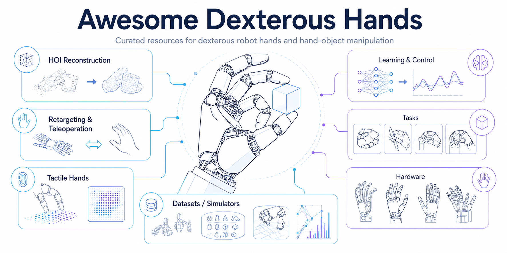

<div align="center">

# Awesome Dexterous Hands

[](https://github.com/CyanHaze/Awesome-Dexterous-Hands/stargazers)
[](https://awesome.re)
[](./CONTRIBUTING.md)

A curated list of papers, datasets, simulators, hardware platforms, and open-source resources for **dexterous robot hands**.

This repository focuses on concrete hand-object manipulation scenarios: reconstructing human hand-object interaction, retargeting or teleoperating it to robot hands, using tactile sensing for contact-rich execution, and evaluating dexterous manipulation on real tasks.

</div>

<p align="center">
  
</p>

---

## News & Updates

- [2026.06] Repository scaffold launched with the first taxonomy for retargeting, HOI reconstruction, tactile dexterous hands, teleoperation, hardware, datasets, and tasks.
- [Ongoing] Paper and resource contributions are welcome. See [CONTRIBUTING.md](./CONTRIBUTING.md).

---

## Scope

This repo is **robot-hand first**. It is not a general tactile-sensing list, not a general hand-pose list, and not a general robot-manipulation list.

Included:

- Dexterous robot hands, anthropomorphic hands, multi-finger hands, and hand-arm systems.
- Human-to-robot hand retargeting, especially object-aware, contact-preserving, and cross-embodiment methods.
- Dexterous teleoperation and data collection systems.
- HOI reconstruction when it helps recover hand-object pose, contact, motion, or demonstrations for robot hands.
- Tactile sensing when it is attached to robot hands or used for dexterous manipulation.
- Datasets, simulators, benchmarks, and open-source tools for dexterous hand-object manipulation.

Excluded by default:

- Pure human hand pose estimation without object interaction.
- Pure HOI action recognition without 3D geometry, contact, or robot relevance.
- Pure tactile sensor material papers without a robot-hand or manipulation connection.
- General parallel-gripper manipulation, unless it introduces a resource directly useful for dexterous hands.
- General VLA / embodied-AI papers without a dexterous-hand component.

---

## Taxonomy Rationale

The repository is organized around a practical pipeline:

| Stage | Main section | Core question |
|---|---|---|
| Human interaction capture | HOI Reconstruction | What did the human hand and object do? |
| Embodiment transfer and data collection | Retargeting and Teleoperation | How can this interaction become executable on a robot hand? |
| Contact sensing | Tactile Dexterous Hands | What does the robot hand feel during execution? |
| Policy learning and control | Learning and Control for Dexterous Hands | How can dexterous skills become robust policies? |
| Execution | Dexterous Manipulation Tasks | Which task is being solved? |
| Platform | Robot Hands and Hardware | Which hand makes the behavior possible? |
| Evaluation | Datasets, Benchmarks, and Simulators | How do we compare progress? |

The intended center of gravity is **retargeting and dexterous robot-hand execution**. HOI reconstruction and tactile sensing are treated as supporting pillars, not separate unrelated lists.

---

## Categories

<ul style="list-style: none; padding: 0;">
<li style="margin-left: 0;"><a href="#surveys-and-roadmaps">Surveys and Roadmaps</a></li>
<li style="margin-left: 0;"><a href="#retargeting-and-teleoperation">Retargeting and Teleoperation</a></li>
<li style="margin-left: 0;"><a href="#hoi-reconstruction-for-dexterous-manipulation">HOI Reconstruction for Dexterous Manipulation</a></li>
<li style="margin-left: 0;"><a href="#tactile-dexterous-hands">Tactile Dexterous Hands</a></li>
<li style="margin-left: 0;"><a href="#learning-and-control-for-dexterous-hands">Learning and Control for Dexterous Hands</a></li>
<li style="margin-left: 0;"><a href="#dexterous-manipulation-tasks">Dexterous Manipulation Tasks</a></li>
<li style="margin-left: 0;"><a href="#robot-hands-and-hardware-platforms">Robot Hands and Hardware Platforms</a></li>
<li style="margin-left: 0;"><a href="#datasets-benchmarks-and-simulators">Datasets, Benchmarks, and Simulators</a></li>
<li style="margin-left: 0;"><a href="#open-source-tools-and-tutorials">Open-Source Tools and Tutorials</a></li>
<li style="margin-left: 0;"><a href="#citation">Citation</a></li>
</ul>

> **Legend**<br>
> ⭐️ Must Read / recommended starting point<br>
> [CODE] Official or high-quality implementation available<br>
> [DATA] Dataset or benchmark available<br>
> **Last Updated:** 2026-06-21

---

# Dexterous Hand Resources

## Surveys and Roadmaps

High-level surveys, primers, and roadmaps for understanding dexterous hands, contact-rich manipulation, tactile sensing, grasping, and adjacent robotics trends.

- **Towards Robotic Dexterous Hand Intelligence: A Survey**. [](https://arxiv.org/abs/2605.13925)
- **Dexterous Manipulation through Imitation Learning: A Survey**. [](https://arxiv.org/abs/2504.03515)
- **Survey of Learning-based Approaches for Robotic In-Hand Manipulation**. [](https://arxiv.org/abs/2401.07915)
- **A Survey on Imitation Learning for Contact-Rich Tasks in Robotics**. [](https://arxiv.org/abs/2506.13498)
- **Multi-Fingered Robotic Grasping: A Primer**. [](https://arxiv.org/abs/1607.06620)
- **Deep Learning Approaches to Grasp Synthesis: A Review**. [](https://arxiv.org/abs/2207.02556) [](https://rhys-newbury.github.io/projects/6dof/)
- **Tactile Sensing: From Humans to Humanoids**. [](https://doi.org/10.1109/TRO.2009.2033627)
- **A Roadmap for AI in Robotics**. [](https://arxiv.org/abs/2507.19975) [](https://doi.org/10.1038/s42256-025-01050-6)

## Retargeting and Teleoperation

This is the primary category of the repository. It covers methods and systems that map human hand motion, hand-object demonstrations, or interaction intent to executable robot-hand behavior.

### Retargeting Methods

- **TopoRetarget**, "Interaction-Preserving Retargeting for Dexterous Manipulation". [](https://arxiv.org/abs/2606.16272) [](https://toporetarget2026.github.io/TopoRetarget/)
- **UniDexTok**, "A Unified Dexterous Hand Tokenizer from Real Data". [](https://arxiv.org/abs/2606.10683)
- **DexTwist**, "Dexterous Hand Retargeting for Twist Motion via Mixed Reality-based Teleoperation". [](https://arxiv.org/abs/2605.12182)
- **UniDex**, "A Robot Foundation Suite for Universal Dexterous Hand Control from Egocentric Human Videos". [](https://arxiv.org/abs/2603.22264)
- **DexMachina**, "DexMachina: Functional Retargeting for Bimanual Dexterous Manipulation". [](https://arxiv.org/abs/2505.24853) [](https://project-dexmachina.github.io/) [](https://github.com/MandiZhao/dexmachina)
- **TypeTele**, "Releasing Dexterity in Teleoperation by Dexterous Manipulation Types". [](https://arxiv.org/abs/2507.01857) [](https://isee-laboratory.github.io/TypeTele/) [](https://github.com/iSEE-Laboratory/TypeTele)
- **DexFlow**, "A Unified Approach for Dexterous Hand Pose Retargeting and Interaction". [](https://arxiv.org/abs/2505.01083)

### Teleoperation and Data Collection

- **DexPilot**, "DexPilot: Vision Based Teleoperation of Dexterous Robotic Hand-Arm System". [](https://arxiv.org/abs/1910.03135) [](https://sites.google.com/view/dex-pilot)
- **Robotic Telekinesis**, "Robotic Telekinesis: Learning a Robotic Hand Imitator by Watching Humans on Youtube". [](https://arxiv.org/abs/2202.10448) [](https://robotic-telekinesis.github.io/)
- **ART-Glove**, "ART-Glove: Articulated Tactile Glove for Contact-Grounded Dexterous Interaction Capture". [](https://arxiv.org/abs/2606.16370)
- **RealDexUMI**, "A Wearable Universal Manipulation Interface for Dexterous Robot Learning". [](https://arxiv.org/abs/2606.06033) [](https://research.beingbeyond.com/realdexumi)
- **DEX-Mouse**, "DEX-Mouse: A Low-cost Portable and Universal Interface with Force Feedback for Data Collection of Dexterous Robotic Hands". [](https://arxiv.org/abs/2604.15013) [](https://dex-mouse.github.io/)
- **UniDex-Cap**, from "UniDex: A Robot Foundation Suite for Universal Dexterous Hand Control from Egocentric Human Videos". [](https://arxiv.org/abs/2603.22264)
- **DEXOP**, "DEXOP: A Device for Robotic Transfer of Dexterous Human Manipulation". [](https://arxiv.org/abs/2509.04441) [](https://dex-op.github.io/)
- **ByteDexter Teleoperation**, "Dexterous Teleoperation of 20-DoF ByteDexter Hand via Human Motion Retargeting". [](https://arxiv.org/abs/2507.03227) [](https://byte-dexter.github.io/)
- **DexWild**, "DexWild: Dexterous Human Interactions for In-the-Wild Robot Policies". [](https://arxiv.org/abs/2505.07813) [](https://dexwild.github.io/) [](https://github.com/dexwild/dexwild) [](https://huggingface.co/datasets/boardd/dexwild-dataset)
- **DexUMI**, "DexUMI: Using Human Hand as the Universal Manipulation Interface for Dexterous Manipulation". [](https://arxiv.org/abs/2505.21864)
- ⭐️ **DexCap**, "DexCap: Scalable and Portable Mocap Data Collection System for Dexterous Manipulation". [](https://arxiv.org/abs/2403.07788) [](https://dex-cap.github.io/) [](https://github.com/j96w/DexCap) [](https://huggingface.co/datasets/chenwangj/DexCap-Data)
- **DexMV**, "DexMV: Imitation Learning for Dexterous Manipulation from Human Videos". [](https://arxiv.org/abs/2108.05877) [](https://yzqin.github.io/dexmv/) [](https://github.com/yzqin/dexmv-sim)

## HOI Reconstruction for Dexterous Manipulation

This section covers HOI reconstruction and upstream egocentric hand-motion recovery when they provide hand-object geometry, contact, dynamics, or demonstrations that can support dexterous manipulation.

### Reconstruction and Tracking

- **WHOLE**, "World-Grounded Hand-Object Lifted from Egocentric Videos". [](https://arxiv.org/abs/2602.22209) [](https://judyye.github.io/whole-www/)
- **AGILE**, "Hand-Object Interaction Reconstruction from Video via Agentic Generation". [](https://arxiv.org/abs/2602.04672) [](https://agile-hoi.github.io/) [](https://github.com/aim-uofa/AGILE)
- **EgoGrasp**, "World-Space Hand-Object Interaction Reconstruction from Egocentric Videos". [](https://arxiv.org/abs/2601.01050) [](https://frank-f2022.github.io/projects/EgoGrasp/) [](https://github.com/MINT-SJTU/EgoGrasp)
- **Dyn-HaMR**, "Recovering 4D Interacting Hand Motion from a Dynamic Camera". [](https://dyn-hamr.github.io/) [](https://github.com/ZhengdiYu/Dyn-HaMR)
- **HaWoR**, "High-fidelity Hand Motion Reconstruction in World Coordinates from Egocentric Videos". [](https://hawor-project.github.io/) [](https://github.com/ThunderVVV/HaWoR)
- **Follow My Hold**, "Hand-Object Interaction Reconstruction through Geometric Guidance". [](https://arxiv.org/abs/2508.18213) [](https://aidilayce.github.io/FollowMyHold-page/) [](https://github.com/aidilayce/FollowMyHold)
- **EmbodMoCap**, "Embodied Motion Capture: 4D Human Reconstruction in Everyday Environments". [](https://arxiv.org/abs/2602.23205) [](https://wenjiawang0312.github.io/projects/embodmocap/) [](https://github.com/WenjiaWang0312/EmbodMocap)
- **ViTaM-D**, "Dynamic Reconstruction of Hand-Object Interaction with Distributed Force-aware Contact Representation". [](https://arxiv.org/abs/2411.09572) [](https://sites.google.com/view/vitam-d/) [](https://github.com/jeffsonyu/ViTaM-D)
- ⭐️ **WiLoR**, "End-to-End 3D Hand Localization and Reconstruction in-the-wild". [](https://arxiv.org/abs/2409.12259) [](https://rolpotamias.github.io/WiLoR/) [](https://github.com/rolpotamias/WiLoR)
- **G-HOP**, "Generative Hand-Object Prior for Interaction Reconstruction and Grasp Synthesis". [](https://arxiv.org/abs/2404.12383) [](https://judyye.github.io/ghop-www)
- ⭐️ **HOLD**, "Category-agnostic 3D Reconstruction of Interacting Hands and Objects from Video". [](https://arxiv.org/abs/2311.18448) [](https://github.com/zc-alexfan/hold)
- **HandNeRF**, "Learning to Reconstruct Hand-Object Interaction Scene from a Single RGB Image". [](https://arxiv.org/abs/2309.07891) [](https://samsunglabs.github.io/HandNeRF-project-page/)

## Tactile Dexterous Hands

Tactile papers are included when the sensor, representation, or policy is connected to robot hands, manipulation, contact estimation, or data collection.

### Tactile Sensing and Perception

- **HT-Bench**, "HT-Bench: Benchmarking Full-Hand Tactile Perception for Dexterous Manipulation". [](https://arxiv.org/abs/2606.19161)
- **FingerEye**, "FingerEye: In-Hand Vision-Tactile Sensor for Dexterous Manipulation". [](https://arxiv.org/abs/2604.20689) [](https://nus-lins-lab.github.io/FingerEyeWeb/)
- **Sparsh / TacBench**, "Sparsh: Self-supervised Touch Representations for Vision-based Tactile Sensing". [](https://arxiv.org/abs/2410.24090) [](https://sparsh-ssl.github.io/)
- **AnySkin**, "Plug-and-play Skin Sensing for Robotic Touch". [](https://arxiv.org/abs/2409.08276) [](https://any-skin.github.io/)

### Tactile In-Hand Manipulation

- **RotateIt**, "General In-Hand Object Rotation with Vision and Touch". [](https://arxiv.org/abs/2309.09979) [](https://haozhi.io/rotateit/)
- **TacGNN**, "TacGNN: Learning Tactile-based In-hand Manipulation with a Blind Robot". [](https://arxiv.org/abs/2304.00736)
- ⭐️ **Dexterity from Touch / T-Dex**, "Dexterity from Touch: Self-Supervised Pre-Training of Tactile Representations with Robotic Play". [](https://arxiv.org/abs/2303.12076) [](https://tactile-dexterity.github.io/) [](https://github.com/irmakguzey/tactile-dexterity)
- ⭐️ **Touch Dexterity**, "Rotating without Seeing: Towards In-hand Dexterity through Touch". [](https://arxiv.org/abs/2303.10880) [](https://touchdexterity.github.io)
- **Learning Purely Tactile In-Hand Manipulation with a Torque-Controlled Hand**. [](https://arxiv.org/abs/2204.03698)

### Visuo-Tactile Dexterous Manipulation

- **T-Rex**, "T-Rex: Tactile-Reactive Dexterous Manipulation". [](https://arxiv.org/abs/2606.17055) [](https://tactile-rex.github.io/) [](https://github.com/ZhuoyangLiu2005/T-Rex) [](https://huggingface.co/datasets/zekaiwang/trex_dataset)
- **RAPID Hand**, "A Robust, Affordable, Perception-Integrated, Dexterous Manipulation Platform for Generalist Robot Autonomy". [](https://arxiv.org/abs/2506.07490)
- **Robot Synesthesia**, "Robot Synesthesia: In-Hand Manipulation with Visuotactile Sensing". [](https://arxiv.org/abs/2312.01853) [](https://yingyuan0414.github.io/visuotactile/)
- **TacSL**, "A Library for Visuotactile Sensor Simulation and Learning". [](https://arxiv.org/abs/2408.06506) [](https://iakinola23.github.io/tacsl/)

## Learning and Control for Dexterous Hands

Representative reinforcement learning, imitation learning, model-based control, perception-based control, and sim-to-real systems for dexterous robot hands.

- ⭐️ **DAPG**, "Learning Complex Dexterous Manipulation with Deep Reinforcement Learning and Demonstrations". [](https://arxiv.org/abs/1709.10087) [](https://sites.google.com/view/deeprl-dexterous-manipulation) [](https://github.com/aravindr93/hand_dapg)
- **PDDM**, "Deep Dynamics Models for Learning Dexterous Manipulation". [](https://arxiv.org/abs/1909.11652) [](https://sites.google.com/view/pddm/)
- ⭐️ **OpenAI Dactyl**, "Solving Rubik's Cube with a Robot Hand". [](https://arxiv.org/abs/1910.07113) [](https://openai.com/index/solving-rubiks-cube/)
- **General In-Hand Re-Orientation**, "A System for General In-Hand Object Re-Orientation". [](https://arxiv.org/abs/2111.03043) [](https://taochenshh.github.io/projects/in-hand-reorientation) [](https://github.com/Improbable-AI/dexenv)
- **HORA**, "In-Hand Object Rotation via Rapid Motor Adaptation". [](https://arxiv.org/abs/2210.04887) [](https://haozhi.io/hora/) [](https://github.com/HaozhiQi/hora)
- **DeXtreme**, "Transfer of Agile In-Hand Manipulation from Simulation to Reality". [](https://arxiv.org/abs/2210.13702) [](https://dextreme.org/) [](https://github.com/isaac-sim/IsaacGymEnvs/tree/main/isaacgymenvs/tasks/dextreme)
- **DexPoint**, "DexPoint: Generalizable Point Cloud Reinforcement Learning for Sim-to-Real Dexterous Manipulation". [](https://arxiv.org/abs/2211.09423) [](https://yzqin.github.io/dexpoint/) [](https://github.com/yzqin/dexpoint-release)
- **DexTrack**, "DexTrack: Towards Generalizable Neural Tracking Control for Dexterous Manipulation from Human References". [](https://arxiv.org/abs/2502.09614) [](https://meowuu7.github.io/DexTrack/) [](https://github.com/Meowuu7/DexTrack)
- **DexHandDiff**, "DexHandDiff: Interaction-aware Diffusion Planning for Adaptive Dexterous Manipulation". [](https://arxiv.org/abs/2411.18562) [](https://dexdiffuser.github.io/) [](https://github.com/Liang-ZX/DexHandDiff)
- **ObjDex**, "Object-Centric Dexterous Manipulation from Human Motion Data". [](https://arxiv.org/abs/2411.04005) [](https://cypypccpy.github.io/obj-dex.github.io/) [](https://github.com/cypypccpy/ObjDexEnvs)
- **DextrAH-G**, "DextrAH-G: Pixels-to-Action Dexterous Arm-Hand Grasping with Geometric Fabrics". [](https://arxiv.org/abs/2407.02274) [](https://sites.google.com/view/dextrah-g) [](https://github.com/NVlabs/DEXTRAH)

## Dexterous Manipulation Tasks

Task-oriented papers and benchmarks can be listed here as a scene index even if their primary entries appear in retargeting, learning and control, tactile, teleoperation, datasets, or benchmarks.

- **DexJoCo**, "DexJoCo: A Benchmark and Toolkit for Task-Oriented Dexterous Manipulation on MuJoCo". [](https://arxiv.org/abs/2605.16257) [](https://dexjoco.github.io/) [](https://github.com/brave-eai/dexjoco) [](https://huggingface.co/datasets/DexJoCo/DexJoCo-Datasets-LeRobot)
- **DexH2R**, "DexH2R: A Benchmark for Dynamic Dexterous Grasping in Human-to-Robot Handover". [](https://arxiv.org/abs/2506.23152) [](https://dexh2r.github.io/) [](https://github.com/4DVLab/DexH2R)
- ⭐️ **DexMimicGen**, "DexMimicGen: Automated Data Generation for Bimanual Dexterous Manipulation via Imitation Learning". [](https://arxiv.org/abs/2410.24185) [](https://dexmimicgen.github.io/) [](https://github.com/NVlabs/dexmimicgen) [](https://huggingface.co/datasets/MimicGen/dexmimicgen_datasets)
- **ObjDex**, "Object-Centric Dexterous Manipulation from Human Motion Data". [](https://arxiv.org/abs/2411.04005) [](https://cypypccpy.github.io/obj-dex.github.io/) [](https://github.com/cypypccpy/ObjDexEnvs)
- **DexArt**, "DexArt: Benchmarking Generalizable Dexterous Manipulation with Articulated Objects". [](https://arxiv.org/abs/2305.05706) [](https://www.chenbao.tech/dexart/) [](https://github.com/Kami-code/dexart-release)
- **DextrAH-G**, "DextrAH-G: Pixels-to-Action Dexterous Arm-Hand Grasping with Geometric Fabrics". [](https://arxiv.org/abs/2407.02274) [](https://sites.google.com/view/dextrah-g) [](https://github.com/NVlabs/DEXTRAH)
- **FunGrasp**, "FunGrasp: Functional Grasping for Diverse Dexterous Hands". [](https://arxiv.org/abs/2411.16755) [](https://hly-123.github.io/FunGrasp/) [](https://github.com/Hly-123/Fungrasp_code)
- **DexDeform**, "DexDeform: Dexterous Deformable Object Manipulation with Human Demonstrations and Differentiable Physics". [](https://arxiv.org/abs/2304.03223) [](https://sites.google.com/view/dexdeform) [](https://github.com/sizhe-li/DexDeform)
- **DexDiffuser**, "DexDiffuser: Generating Dexterous Grasps with Diffusion Models". [](https://arxiv.org/abs/2402.02989) [](https://yulihn.github.io/DexDiffuser_page/) [](https://github.com/YuLiHN/DexDiffuser)
- **Visuomotor Diffusion for In-Hand Manipulation**, "Learning Dexterous In-Hand Manipulation with Multifingered Hands via Visuomotor Diffusion". [](https://arxiv.org/abs/2503.02587) [](https://dex-manip.github.io/)
- **ViserDex**, "ViserDex: Visual Sim-to-Real for Robust Dexterous In-hand Reorientation". [](https://arxiv.org/abs/2604.11138) [](https://rffr.leggedrobotics.com/works/viserdex/)
- **MultiGrasp**, "Grasp Multiple Objects with One Hand". [](https://arxiv.org/abs/2310.15599) [](https://multigrasp.github.io/) [](https://github.com/MultiGrasp/MultiGrasp)
- **DexVIP**, "DexVIP: Learning Dexterous Grasping with Human Hand Pose Priors from Video". [](https://arxiv.org/abs/2202.00164) [](https://vision.cs.utexas.edu/projects/dexvip-dexterous-grasp-pose-prior/)
- **UniDexGrasp++**, "UniDexGrasp++: Improving Dexterous Grasping Policy Learning via Geometry-aware Curriculum and Iterative Generalist-Specialist Learning". [](https://arxiv.org/abs/2304.00464) [](https://github.com/PKU-EPIC/UniDexGrasp2)
- **UniDexGrasp**, "Universal Robotic Dexterous Grasping via Learning Diverse Proposal Generation and Goal-Conditioned Policy". [](https://arxiv.org/abs/2303.00938) [](https://github.com/PKU-EPIC/UniDexGrasp2)
- **GenDexGrasp**, "GenDexGrasp: Generalizable Dexterous Grasping". [](https://arxiv.org/abs/2210.00722) [](https://tongclass.ac.cn/publication/2022/gendexgrasp/) [](https://github.com/tengyu-liu/GenDexGrasp)
- ⭐️ **ARCTIC**, "A Dataset for Dexterous Bimanual Hand-Object Manipulation". [](https://arxiv.org/abs/2204.13662) [](https://arctic.is.tue.mpg.de)

## Robot Hands and Hardware Platforms

Robot hands, hand-arm platforms, and platform papers that include design, sensing, actuation, or reproducibility details.

- ⭐️ **LEAP Hand**, "LEAP Hand: Low-Cost, Efficient, and Anthropomorphic Hand for Robot Learning". [](https://arxiv.org/abs/2309.06440) [](https://leap-hand.github.io/) [](https://github.com/leap-hand/LEAP_Hand_API)
- **DexLink Hand**, "DexLink Hand: A Compact, Affordable, 16-DOF Linkage-Driven Hand with Human-Like Dexterity". [](https://arxiv.org/abs/2606.17418)
- **ByteDexter Hand**, from "Dexterous Teleoperation of 20-DoF ByteDexter Hand via Human Motion Retargeting". [](https://arxiv.org/abs/2507.03227) [](https://byte-dexter.github.io/)
- **RAPID Hand**, "A Robust, Affordable, Perception-Integrated, Dexterous Manipulation Platform for Generalist Robot Autonomy". [](https://arxiv.org/abs/2506.07490)
- **Tactile SoftHand-A**, "Tactile SoftHand-A: 3D-Printed, Tactile, Highly-underactuated, Anthropomorphic Robot Hand with an Antagonistic Tendon Mechanism". [](https://arxiv.org/abs/2406.12731) [](https://github.com/SoutheastWind/Tactile_SoftHand_A)
- **All the Feels / DManus**, "All the Feels: A dexterous hand with large-area tactile sensing". [](https://arxiv.org/abs/2210.15658) [](https://sites.google.com/view/roboticsbenchmarks/platforms/dmanus)

## Datasets, Benchmarks, and Simulators

Resources for training, evaluating, or simulating dexterous hand-object manipulation.

### HOI and Dexterous Demonstration Datasets

- ⭐️ **EgoVerse**, "An Ecosystem for Curating, Accessing, and Learning from Human Data for Robot Learning". [](https://arxiv.org/abs/2604.07607) [](https://egoverse.ai/) [](https://github.com/GaTech-RL2/EgoVerse)
- **DexWild**, "DexWild: Dexterous Human Interactions for In-the-Wild Robot Policies". [](https://arxiv.org/abs/2505.07813) [](https://dexwild.github.io/) [](https://github.com/dexwild/dexwild) [](https://huggingface.co/datasets/boardd/dexwild-dataset)
- ⭐️ **DexMimicGen**, "DexMimicGen: Automated Data Generation for Bimanual Dexterous Manipulation via Imitation Learning". [](https://arxiv.org/abs/2410.24185) [](https://dexmimicgen.github.io/) [](https://github.com/NVlabs/dexmimicgen) [](https://huggingface.co/datasets/MimicGen/dexmimicgen_datasets)
- ⭐️ **DexCap**, "DexCap: Scalable and Portable Mocap Data Collection System for Dexterous Manipulation". [](https://arxiv.org/abs/2403.07788) [](https://dex-cap.github.io/) [](https://github.com/j96w/DexCap) [](https://huggingface.co/datasets/chenwangj/DexCap-Data)
- **DexterCap**, "DexterCap: An Affordable and Automated System for Capturing Dexterous Hand-Object Manipulation". [](https://arxiv.org/abs/2601.05844)
- **UniDex-Dataset**, from "UniDex: A Robot Foundation Suite for Universal Dexterous Hand Control from Egocentric Human Videos". [](https://arxiv.org/abs/2603.22264)
- **EmbodMoCap**, "Embodied Motion Capture: 4D Human Reconstruction in Everyday Environments". [](https://arxiv.org/abs/2602.23205) [](https://wenjiawang0312.github.io/projects/embodmocap/) [](https://github.com/WenjiaWang0312/EmbodMocap)
- ⭐️ **HOT3D**, "Hand and Object Tracking in 3D from Egocentric Multi-View Videos". [](https://arxiv.org/abs/2411.19167) [](https://facebookresearch.github.io/hot3d/) [](https://github.com/facebookresearch/hot3d)
- ⭐️ **ARCTIC**, "A Dataset for Dexterous Bimanual Hand-Object Manipulation". [](https://arxiv.org/abs/2204.13662) [](https://arctic.is.tue.mpg.de)
- **DexYCB**, "DexYCB: A Benchmark for Capturing Hand Grasping of Objects". [](https://arxiv.org/abs/2104.04631) [](https://dex-ycb.github.io/) [](https://github.com/NVlabs/dex-ycb-toolkit)

### Dexterous Grasping Datasets

- **DexGraspNet 2.0**, "DexGraspNet 2.0: Learning Generative Dexterous Grasping in Large-scale Synthetic Cluttered Scenes". [](https://arxiv.org/abs/2410.23004) [](https://pku-epic.github.io/DexGraspNet2.0/) [](https://github.com/PKU-EPIC/DexGraspNet2) [](https://huggingface.co/datasets/lhrlhr/DexGraspNet2.0)
- **DexGraspNet**, "DexGraspNet: A Large-Scale Robotic Dexterous Grasp Dataset for General Objects Based on Simulation". [](https://arxiv.org/abs/2210.02697) [](https://pku-epic.github.io/DexGraspNet/) [](https://github.com/PKU-EPIC/DexGraspNet)

### Dexterous Manipulation Benchmarks and Simulators

- ⭐️ **Adroit / DAPG**, "Learning Complex Dexterous Manipulation with Deep Reinforcement Learning and Demonstrations". [](https://arxiv.org/abs/1709.10087) [](https://sites.google.com/view/deeprl-dexterous-manipulation) [](https://github.com/aravindr93/hand_dapg) [](https://github.com/Farama-Foundation/D4RL/wiki/Tasks#Adroit)
- **Bi-DexHands**, "Towards Human-Level Bimanual Dexterous Manipulation with Reinforcement Learning". [](https://arxiv.org/abs/2206.08686) [](https://pku-marl.github.io/DexterousHands/) [](https://github.com/PKU-MARL/DexterousHands)
- **DexJoCo**, "DexJoCo: A Benchmark and Toolkit for Task-Oriented Dexterous Manipulation on MuJoCo". [](https://arxiv.org/abs/2605.16257) [](https://dexjoco.github.io/) [](https://github.com/brave-eai/dexjoco) [](https://huggingface.co/datasets/DexJoCo/DexJoCo-Datasets-LeRobot)
- **DexH2R**, "DexH2R: A Benchmark for Dynamic Dexterous Grasping in Human-to-Robot Handover". [](https://arxiv.org/abs/2506.23152) [](https://dexh2r.github.io/) [](https://github.com/4DVLab/DexH2R)
- **POMDAR**, "A Benchmark of Dexterity for Anthropomorphic Robotic Hands". [](https://arxiv.org/abs/2604.09294) [](https://srl-ethz.github.io/POMDAR/) [](https://github.com/srl-ethz/pomdar_benchmark)

### Tactile Datasets and Simulators

- **Sparsh / TacBench**, "Sparsh: Self-supervised Touch Representations for Vision-based Tactile Sensing". [](https://arxiv.org/abs/2410.24090) [](https://sparsh-ssl.github.io/)
- **HT-Bench**, "HT-Bench: Benchmarking Full-Hand Tactile Perception for Dexterous Manipulation". [](https://arxiv.org/abs/2606.19161)
- **TacSL**, "A Library for Visuotactile Sensor Simulation and Learning". [](https://arxiv.org/abs/2408.06506) [](https://iakinola23.github.io/tacsl/)

## Open-Source Tools and Tutorials

Reusable codebases, simulators, robot assets, and implementation references for building dexterous-hand research pipelines.

### Retargeting and Teleoperation Toolkits

- ⭐️ **Dex Retargeting**, a Python toolkit for translating human hand motion to robot hand motion. [](https://github.com/dexsuite/dex-retargeting)
- **AnyTeleop**, a general vision-based dexterous arm-hand teleoperation system. [](https://yzqin.github.io/anyteleop/)
- **OPEN TEACH**, a VR-based teleoperation and demonstration collection framework for robotic manipulation. [](https://open-teach.github.io/) [](https://github.com/aadhithya14/Open-Teach)
- ⭐️ **Open-TeleVision**, a teleoperation framework with immersive active visual feedback. [](https://robot-tv.github.io/) [](https://github.com/OpenTeleVision/TeleVision)
- **DexMachina**, a functional retargeting codebase and benchmark for bimanual dexterous manipulation. [](https://project-dexmachina.github.io/) [](https://github.com/MandiZhao/dexmachina)

### Simulation and Robot Assets

- ⭐️ **Isaac Lab / Isaac Gym Envs**, GPU-accelerated robot-learning frameworks and benchmark environments for reinforcement learning, imitation learning, motion planning, and sim-to-real pipelines. [](https://arxiv.org/abs/2511.04831) [](https://arxiv.org/abs/2108.10470) [](https://github.com/isaac-sim/IsaacLab) [](https://github.com/isaac-sim/IsaacGymEnvs)
- ⭐️ **ManiSkill**, a GPU-parallelized robot learning simulator and benchmark. [](https://github.com/mani-skill/ManiSkill)
- **SAPIEN**, a physics-rich embodied AI simulation platform. [](https://sapien.ucsd.edu/) [](https://github.com/haosulab/SAPIEN)
- ⭐️ **MuJoCo Menagerie**, a curated collection of high-quality MuJoCo robot models. [](https://github.com/google-deepmind/mujoco_menagerie)
- **Dex URDF**, a collection of URDF models for dexterous hands and objects. [](https://github.com/dexsuite/dex-urdf)
- **robot_descriptions.py**, Python loaders for open-source robot descriptions across robotics frameworks. [](https://github.com/robot-descriptions/robot_descriptions.py)
- **LEAP Hand API**, the official API for controlling LEAP Hand. [](https://github.com/leap-hand/LEAP_Hand_API)

### Tactile and Sensing Toolkits

- **TacSL**, a visuotactile sensor simulation and learning library. [](https://iakinola23.github.io/tacsl/) [](https://github.com/iakinola23/tacsl)
- **TACTO**, a simulator for vision-based tactile sensors. [](https://github.com/facebookresearch/tacto)
- **Tactile Gym 2.0**, a PyBullet suite for tactile reinforcement learning and sim-to-real experiments. [](https://github.com/ac-93/tactile_gym)
- **AnySkin Interface**, the interfacing repository for the AnySkin tactile sensor. [](https://any-skin.github.io/) [](https://github.com/raunaqbhirangi/anyskin)
- **Sparsh**, a self-supervised touch representation codebase for vision-based tactile sensing. [](https://sparsh-ssl.github.io/) [](https://github.com/facebookresearch/sparsh)

### Hand and HOI Utility Libraries

- **manotorch**, a differentiable MANO hand model layer in PyTorch with anatomy-consistent utilities. [](https://github.com/lixiny/manotorch)
- **manopth**, a differentiable MANO hand model layer for PyTorch. [](https://github.com/hassony2/manopth)
- ⭐️ **HaMeR**, a 3D hand mesh recovery codebase for monocular hand reconstruction. [](https://geopavlakos.github.io/hamer/) [](https://github.com/geopavlakos/hamer)
- **hand_tracking_toolkit**, utilities for loading Meta hand-object datasets and evaluating hand tracking. [](https://github.com/facebookresearch/hand_tracking_toolkit)

## Citation

If you find this repository useful, please consider citing it:

```bibtex
@misc{awesome_dexterous_hands,
  title  = {Awesome Dexterous Hands},
  author = {CyanHaze},
  year   = {2026},
  url    = {https://github.com/CyanHaze/Awesome-Dexterous-Hands}
}
```
